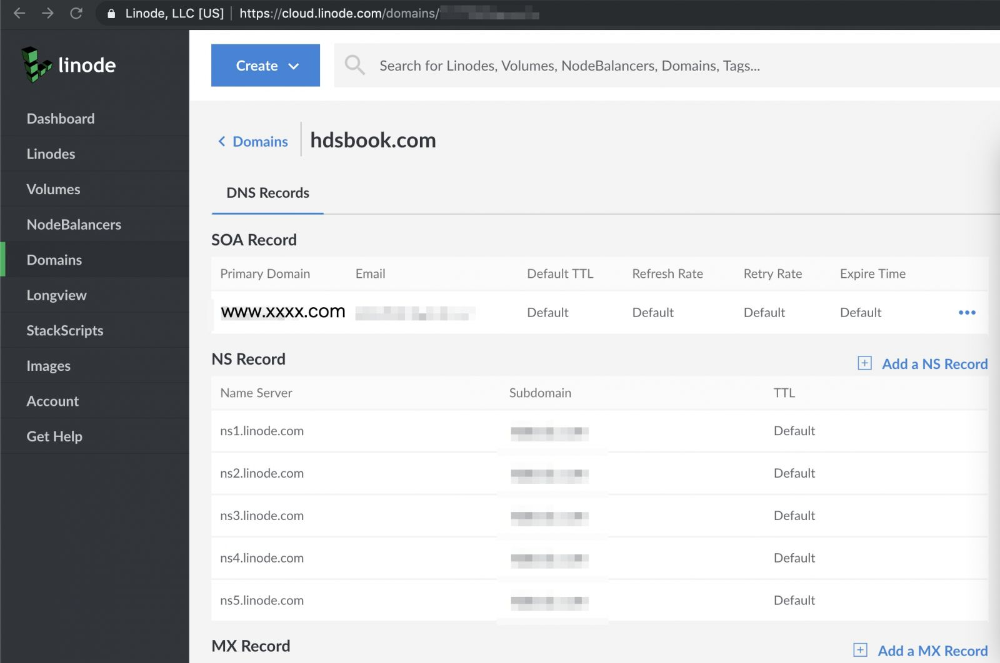
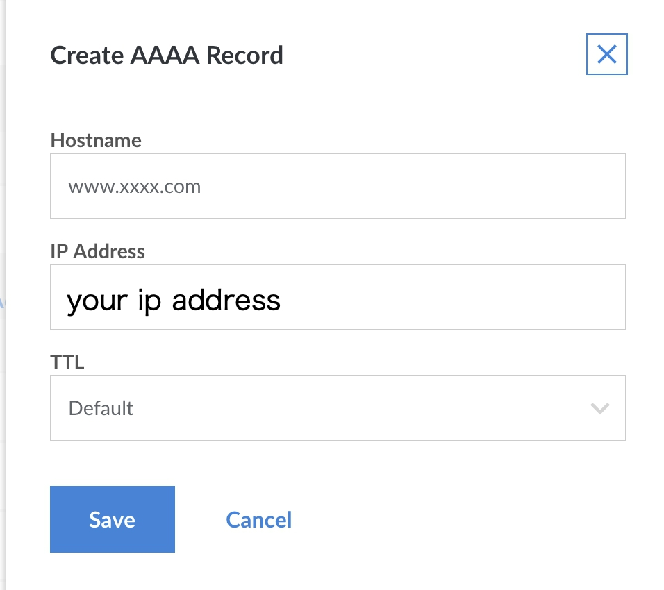
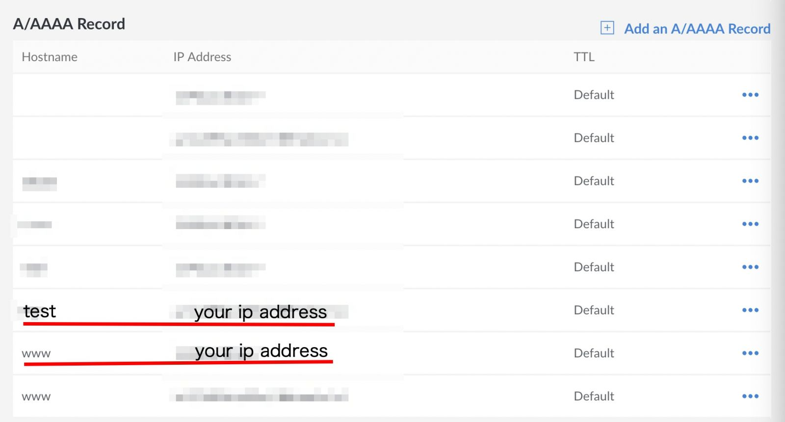
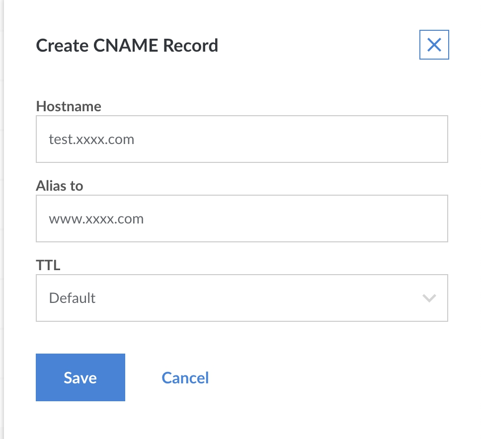

# 設定子網域


<!--more-->

我的 server 是在 [Linode](https://www.linode.com/) 上租的

網域名稱則是在 [Goddady](https://tw.godaddy.com/) 上註冊的

雖然可以在 Goddady 上面做 domain name 對應 ip 的托管

我選擇在 Linode 上托管我的網域名稱

此篇文章分享的是在 Linode上設定子網域

---
### 什麼是子網域

什麼是子網域(subdomain)呢

以小弟的網站來說，www.hdsbook.com

.com 為第一層級網域名稱 Top Level Domain (TLD)

hdsbook 為第二層級網域名稱 Second Level Domain (SLD)

通常我們跟域名註冊商 (如Goddady) 註冊的就是這兩層 domain name

而最前面的 www 就是 subdomain, 中文可以稱其為 (主/子網域)

我們最常見的 www.google.com (估狗首頁)，mail.google.com(信箱)，drive.google.com(雲端硬碟)…

其實就是子網域的應用啦

一個域名其實可以擁有很多個子網域(www, mail, drive...)，通常以 www 做為主網站

---

所以呢，如果你有多個網站在經營，而這些網站可能都只是同一間公司的不同事業體

則你可以選擇設定不同的子網域名稱，就不用多花錢註冊那麼多的網域名稱啦

---
### 如何設定子網域

那麼怎麼設定呢, 假設你的域名稱為 xxxx.com

首先，在你的 server 上故好三件事

#### Step 1. 放上你的網站

ex:

/var/www/www.xxxx.com

/var/www/test.xxxx.com

#### Step 2. apache2.conf

```
<Directory /var/www/www.xxxx.com/>
        AllowOverride AllRequire all granted
</Directory>

<Directory /var/www/test.xxxx.com/>
        AllowOverride AllRequire all granted
</Directory>
```

#### Step 3. virtual host

新增 www.xxxx.com.conf 和 test.xxxx.com.conf, 內容格式如下

```
# www.xxxx.com.conf
<VirtualHost *:80>
    DocumentRoot /var/www/www.xxxx.com/
    ServerName www.xxxx.com
</VirtualHost>
```

```
# test.xxxx.com.conf
<VirtualHost *:80>
    DocumentRoot /var/www/test.xxxx.com/
    ServerName www.xxxx.com
</VirtualHost>
```

執行以下指令：

```
a2ensite www.xxxx.com.conf
a2ensite test.xxxx.com.conf
sudo service apache2 restart
```

#### Step 4 Linode 托管設定

最後來到你的 Linode 做最後的 dns 托管設定：(登入後進入你租的server然後點選domains)



把 www.xxxx.com 和 test.xxxx.com 都加到 A record



然後你會看到你的子網域都被加到 a record



其實有些網站會教你非主網域 加 CNAME record

不過其實是差不多的意思，只是 A record 是直接對應到 IP

CNAME 則是先對應到其它dns，再對應到其對應的IP

詳細差別可以看這篇文章：[https://support.dnsimple.com/articles/differences-between-a-cname-alias-url/](https://support.dnsimple.com/articles/differences-between-a-cname-alias-url/)

小弟兩個都嘗試過，其實都是有用的

若你是要加 CNAME record，www.xxxx.com還是要先加到 A record，然後

加 CNAME record 時 ，alias to 要填寫www.xxxx.com



做完已上設定，最多大概等一小時，就可以用這兩個網址連到你的網站啦

---

p.s. 其實 Goddady 就可以做子網域設定

但是每次我在Linode做完子網域設定，等5分鍾就有了

超有效率，不知道是不是跟 server 位置和他們的托管 server 距離有關係

總之在 Goddady 設定完要等一到兩天，這種不安全感是滿討厭的

所以自此我都是讓Linode托管我的 dns

如果讀者也想租Linode server，可以選在日本或新加坡的主機

感覺和台灣比較近連線速度也有差？(還是心裡作用)

