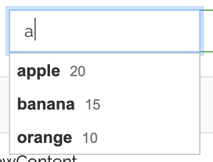

# Autocomplete，自訂義下拉樣式


<!--more-->

jQuery UI 是一個 javascript 套件，提供一些方便的樣式和介面工具 (官方網站：[https://jqueryui.com](https://jqueryui.com/))

此篇文章要紀錄的是其中的 autocomplete 如何自訂義其提示下拉的樣式

使提示的 menu option 也能有像 bootstrap-select 的 subtext 的效果

html:

```html
<input class="autocomplete_fruit" type="text" />
```

javascript:

```javascript
$('.autocomplete_fruit').autocomplete({
    minLength: 1,
    source: [
        {
            label: 'apple',
            price: 20
        },
        {
            label: 'banana',
            price: 15
        },
        {
            label: 'orange',
            price: 10
        }
    ],
    create: function (event, ui) {
        $(this).data('ui-autocomplete')._renderItem  = function (ul, item) {
            return $("<li>").attr('data-value', item.label).append(
                $("<div>").addClass('ui-menu-item-wrapper').append(
                    $("<b>").html(item.label).append(
                        $("<small>").addClass('text-muted pl-2').html(item.price)
                    )
                )
            ).appendTo(ul);
        };
    }
});
```

由例程式可知，用 _renderItem 這個 method 就可以直接改寫下拉中每一個 li 的內容(它的下拉結構是一個ulist)

比較奇怪的是如果這個 _rerenderItem 直接寫在 autocomplete 初始的物件參數中，會沒有作用，

一定要在 create 中呼叫，且乎叫時前面還要加上 .data('ui-autocomplete') ，這點我也還想不明白

---

然後 _renderItem 這個函式要回傳 menu option(li) 的 jquery 物件，所以用 appendTo(ul)

如果用 `$(ul).append($("<li>").....`，則回傳的會是 ul 的物件

render 後的 menu 在滑鼠 hover 上去時 console 會一直 log 錯誤訊息

---

至於 li 中的 div 我在這邊給予他 ui-menu-item-wrapper 的 class

因為它的js、css會來抓這個class，讓滑鼠 hover 過去時會有藍底的 style

---

完成後的結果就如下圖：



詳細可看我的 codepen: [https://codepen.io/ginnyzang/pen/yZobpv](https://codepen.io/ginnyzang/pen/yZobpv)

參考資料：[https://stackoverflow.com/questions/37045318/jquery-ui-custom-autocomplete-renderitem-and-rendermenu-not-working](https://stackoverflow.com/questions/37045318/jquery-ui-custom-autocomplete-renderitem-and-rendermenu-not-working)
