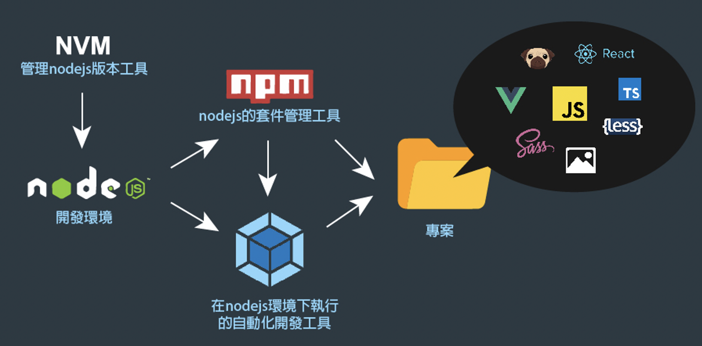
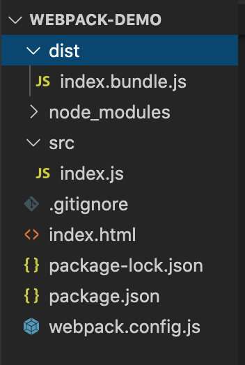

# Webpack 學習筆記


<!--more-->

## 什麼是 Webpack ？

隨著時代的演進，現代前端的開發不再只是 html、css、js 三大元素。

現代前端多了很多新技術與框架，如 scss、pug、Vue、React、ES6 javascript、CSS3 等…

但是我們的瀏覽器(如：古早味的IE)可能還是只看得懂舊版的 html、css、js，

所以我們需要一個第三方的打包工具，來幫我們編譯這些新技術程式碼，

轉換為瀏覽器看得懂的最原始的三大元素 (html、css、js)，

並且在打包的過程中可以進行壓縮，優化程式碼的效能。

而這些第三方的打包工具中(如：Webpack, gulp.js…)，最廣為人知，被許多框架採用的，

就是 [Webpack](https://webpack.js.org/)。

## 什麼是 Babel？

[Babel](https://babeljs.io/) 可以幫我們把高版本 (ECMAScript 6 以上) 的 javascript，降轉成舊版本等效的 js 讓瀏覽器能夠去解讀。

也就是說如果只用 Webpack 打包 javascript，部份瀏覽器還是會因為其中用了 es6 的語法而無法運行。

若在 Webpack 上掛載 Babel 模組，就可以在打包的過程也進行 js 版本的降轉。

<br>

一般我們使用 Webpack ，都會掛載 babel 來為我們降轉 js 版本，

使打包出來的檔案可以被大部份瀏覽器解讀 (理論上可以支持到 ie 9)，

在 laravel 中，laravel-mix 所用的 webpack 就預設整合了 babel 模組。


## Webpack 的部署



Webpack 建立在 node.js 的開發環境下，所以電腦需先裝好 node.js，

而 [nvm(Node Version Manager)](https://github.com/nvm-sh/nvm) 是用來 安裝/使用 不同版本的 node.js 的工具，

因此若要在 mac 上安裝 node.js ，可以

**先用 homebrew 安裝 nvm，再用 nvm 安裝 node.js**，步驟記錄如下：

### 1. 安裝 Node.js
(參考自：[Install NVM On Mac With Brew](https://medium.com/@jamesauble/install-nvm-on-mac-with-brew-adb921fb92cc))

1. 若電腦中已有安裝 node，先取消安裝之
    ```shell
    brew uninstall --ignore-dependencies node
    brew uninstall --force node
    ```

2. 安裝 nvm
    ```shell
    brew update
    brew install nvm
    ```

3. 安裝後，它會提示你建立一個資料夾
    ```shell
    mkdir ~/.nvm
    ```

4. 並在~/.bash_profile 中寫入：
    ```shell
    export NVM_DIR=~/.nvm
    source $(brew --prefix nvm)/nvm.sh
    ```
5. 執行 `source ~/.bash_profile`
6. nvm install [版本號，不用輸入得很精確]
    ```shell
    nvm install 12
    ```
7. 查看 node.js 版本
    ```shell
    nvm ls
    ```
8. 切換 node.js 版本
    ```shell
    nvm use 12
    ```


### 2. 安裝 Webpack
```shell
npm i -g webpack
npm i -g webpack-dev-server
npm i -g webpack-cli
```

### 3. 部署 Webpack

1. 建立資料夾並初始化
    ```shell
    mkdir webpack-demo
    cd webpack-demo
    npm init -y
    ```
2. 安裝 webpack-cli
    ```shell
    npm install webpack webpack-cli --save-dev
    ```

3. 新增 index.js 與 webpack.config.js

    ***webpack-demo/src/index.js***
    ```javascript
    const arr = ['1', '2', '3'];
    arr.map(item => console.log(item));
    ```

    ***webpack-demo/webpack.config.js***
    ```javascript
    const path = require('path');

    module.exports = {
        entry: './src/index.js',
        output: {
            path: path.resolve(__dirname, 'dist'),
            filename: 'index.bundle.js'
        },
    };
    ```

    上面的設定就是要把 ./src/index.js 打包到 ./dist/index.bundle.js

    設定好便可執行 `webpack` 指令進行打包，打包後，檔案結構如下圖所示

    ```shell
    webpack
    ```

    

    到目前為止，因為我們只有用webpack進行打包，還沒有掛載 babel 做js版本的降轉，

    所以如果仔細去看打包出來的 index.bundle.js，裡面的內容還是維持 index.js 中 es6 的語法

### 4. 掛載 Babel 模組

1. 安裝 babel-loader (參考自官方文件 [babel-loader](https://webpack.js.org/loaders/babel-loader/))，於 webpack-demo 資料夾執行：

    ```shell
    npm install -D babel-loader @babel/core @babel/preset-env
    ```

    `-D` 與 `--save-dev` 同義，就是要把模組資訊加到 package.json 中

2. 於 webpack.config.js 中加入模組設定，加入後 webpack.config.js 如下
    ```shell
    const path = require('path');

    module.exports = {
        entry: './src/index.js',
        output: {
            path: path.resolve(__dirname, 'dist'),
            filename: 'index.bundle.js'
        },
        module: {
            rules: [
                {
                    test: /\.m?js$/,
                    exclude: /(node_modules|bower_components)/,
                    use: {
                        loader: 'babel-loader',
                        options: {
                            presets: ['@babel/preset-env']
                        }
                    }
                }
            ]
        }
    };
    ```

    此時再執行 webpack 打包，出來的 index.bundle.js 就會是經過降轉的 js 了

### 5. webpack 指令說明

webpack 指令其實可以指定 mode (development/production)，和給一個 watch 參數使其能自動打包

> development mode 為開發階段所用，為提高打包效率，不進行壓縮；
>
> production mode 為上線專案所用，進行壓縮以提高程式執行效能，但打包過程需要較多時間。
>
> 當給予 --watch 參數時，webpack 會監聽檔案的 onchange，當檔案發生變動時，自動進行打包。

- `webpack --mode development`
  - 進行一次打包 (不進行壓縮)
- `webpack --mode production`
  - 進行一次打包 (進行壓縮，較耗效能)
- `webpack --mode development --watch`
  - 持續監聽檔案，若有更動，即時進行打包 (不進行壓縮)

### 6. npm run script 設定

在 package.json 中，有一個很方便的 scripts 設定，讓我們可以簡化執行 webpack 的指令

打開 package.json，在 scripts 設定中加入：

```json
"scripts": {
  "watch": "webpack --mode development --watch",
  "start": "webpack --mode development",
  "deploy": "webpack --mode production"
},
```

這樣當我們想執行 `webpack --mode development --watch`，就可以直接執行`npm run watch`；
想執行 `webpack --mode development`，就執行 `npm run start`，以此類推…

<br>

開發階段，用 `npm run watch`

部署到正試機，用 `npm run deploy`

## 參考資料
- [Webpack 前端自動化開發超入門](https://www.youtube.com/watch?v=vyI-Ko6fvKU)

## 練習檔案
- https://github.com/hdsbook/webpack-demo
