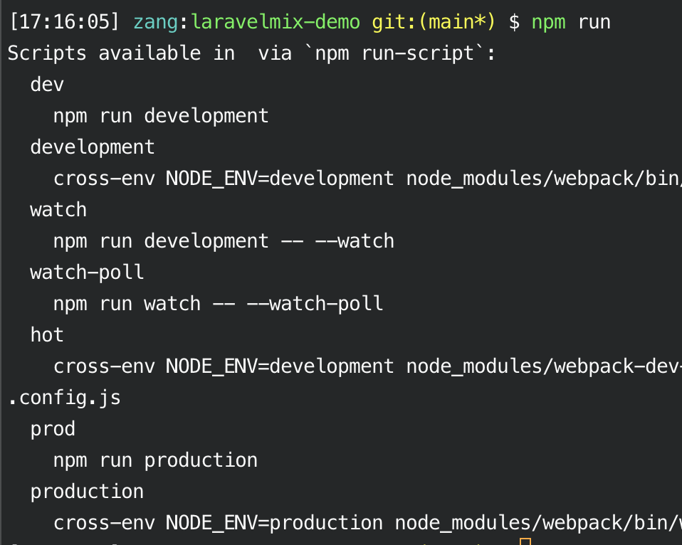

# Laravel mix 學習筆記


<!--more-->

> Laravel Mix 提供了一個優雅的 API 來為你的專案設定 Webpack

許多人在入門 [Webpack](https://webpack.js.org/) 的時候一定和小弟一樣會遇到一個瓶頸，

就是覺得 webpack.config.js 不知道怎麼設定！

沒有人手把手帶的話實在要花很多時間去理解它的設定規則…

[Laravel mix](https://laravel-mix.com) 提供一系列優雅的 api，讓你可以更直觀的做 webpack 的設定，

真的是降低了很大的 webpack 使用門檻！

## 在 laravel 中使用 laravel mix

### 建立專案

1. new a project
    ```shell
    composer create-project laravel/laravel --prefer-dist laravelmix-demo
    ```

2. 執行 `npm install` 來安裝 laravel 預設會用到的 node packages

    (如：lodash, bootstrap, webpack, babel...)

    ```shell
    npm install
    ```
3. 執行 `npm run` 可以查看有哪些 scripts 可以使用 (設定在 package.json)
  
  - `npm run dev`：`npm run development`的縮寫，進行一次打包
  - `npm run watch`：監聽檔案更動，即時執行打包
  - `npm run watch-poll`：在某些系統上，npm run watch 並不總是有效的，此時可以嘗試使用此指令
  - `npm run prod`：`npm run production`的縮寫，進行一次打包並壓縮(minify)程式碼

### 資料夾結構

> 此篇文章的 laravel 版本是 laravel 8

laravel 8 預設的 webpack.mix.js 設定如下：

```javascript
mix.js('resources/js/app.js', 'public/js')
    .postCss('resources/css/app.css', 'public/css', [
        //
    ]);
```

在這個設定下執行過一次打包後(`npm run dev`)，資料夾結構如下：

- 📂 **public**
  - 📂 js
    - `app.js`：打包後的js
  - 📂 css
    - `app.css`：打包後的css
  - `mix-manifest.json`：自動產生，可以從這個檔案看出所有打包檔案的來源檔案
- 📂 **resources**
  - 📂 **css**
    - `app.css`：預設的來源css
  - 📂 **js**
    - `app.js`：預設的來源js，會 require bootstrap.js
    - `bootstrap.js`：此 bootstrap 非彼 bootstrap，而是指一個用來引入/設定所有需要套件的js(如：axios, lodash...)
- `webpack.mix.js`：使用 laravel mix 提供的 api 進行 webpack 的設定

### laravel mix api 說明

> 下為 laravel 8 預設的 webpack.mix.js 設定，這段設定相當直觀，就是
>
> - 將 `resources/js/app.js` 打包到 `public/js` 資料夾中 (`public/js/app.js`)
> - 將 `resources/css/app.css` 打包到 `public/css` 資料夾中 (`public/css/app.css`)


***webpack.mix.js***

```javascript
mix.js('resources/js/app.js', 'public/js')
    .postCss('resources/css/app.css', 'public/css');
```

#### PostCSS？

[PostCss](https://postcss.org/) 是一個使用 JavaScript 轉換 CSS 的工具，可以做的事情[很多](https://github.com/postcss/postcss/blob/master/README.md#plugins)，如：
- [autoprefixer](https://github.com/postcss/autoprefixer) 加入各家瀏覽器的前綴詞 (-webkit-、-moz- 等…)。
- [postcss-preset-env](https://github.com/csstools/postcss-preset-env) 將modern css轉為目前主流瀏覽器所能支援的語法
- [Linters](https://github.com/postcss/postcss/blob/master/README.md#Linters) 當有語法錯誤時，console 錯誤訊息

相較於 sass, scss 等預處理器（Preprocessors），PostCSS 同時扮演後處理器（Postprocessors）的角色
- 預處理器：讓開發者撰寫一些類似 CSS 的語法，再轉為瀏覽器能懂的 CSS
- 後處理器：寫好的 CSS 經過擴充功能（plugin）的後製處理，將特定功能轉成瀏覽器能懂的指令。

```css
/*
laravel 8 預設用 PostCSS 編譯 app.css，
所以當我在 resources/css/app.css 寫入：
*/
input.test {
    appearance: slider-horizontal;
}

/* 經過打包後，public/css/app.css 會呈現： */
input.test {
    -webkit-appearance: slider-horizontal;
       -moz-appearance: slider-horizontal;
            appearance: slider-horizontal;
}
/* 這是由於 PostCSS 的 autoprefixer 為其加上了各瀏覽器的前綴詞 */
```

#### 將多個檔案合併打包至一個檔案

```javascript
mix.styles([
    'resources/css/card.css',
    'resources/css/button.css'
], 'public/css/card-and-btn.css');

mix.scripts([
    'resources/js/disscount.js',
    'resources/js/product.js'
], 'public/js/cart.js');
```

也可以用 import 的方式進行合併檔案
- css 可以用 postcss-import
- javascript 可以用 es6 module 語法

## 參考資料

- [Getting Started with Laravel Mix, Part 2: Setup](https://www.youtube.com/watch?v=0gBKy91k-cQ&list=PLylMDDjFIp1Dc_dgUY7q3TEG86RzXnR5P&index=2)
- [PostCSS | Summer。桑莫。夏天](https://cythilya.github.io/2018/08/10/postcss/)
