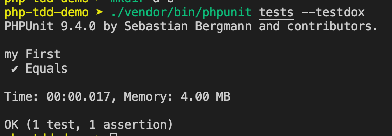

# PHPUnit 入門


<!--more-->

> [PHPUnit](https://phpunit.de/index.html) 是 PHP編程語言的單元測試框架。
>
> 本文從最簡單的範例，說明 PHPUnit 的使用方法


OS: macOS 10.15.7

php: 7.3.22

composer: 1.9.2


## 1. 建立測試專案

1. 建立專案資料夾並安裝最新版的 phpunit
    ```shell
    take php-tdd-demo
    composer require phpunit/phpunit
    ```

    也可以指定要安裝的版本，如：

    ```shell
    composer require phpunit/phpunit ^9
    ```

    這裡我們並不是全域安裝 phpunit，而是在這個專案下可以透過 `./vendor/bin/phpunit` 來執行 phpunit

    例如執行以下指令查看 phpunit 版本

    ```shell
    ./vendor/bin/phpunit --version
    ```

2. 建立 src, tests 資料夾
    ```shell
    mkdir src tests
    ```
    此時我們的資料夾結構就如下：
    - 📂 **src**
      - `我們的來源php程式碼(要被測試的程式)放在這裡`
    - 📂 **tests**
      - `測試程式將被放到這裡來`
    - 📂 **vendor**
    - composer.json
    - composer.lock

## 2. 建立我的第一支測試程式

1. 在 `tests/` 資料夾新增一個檔案 `myFirstTest.php`
    ```shell
    touch tests/myFirstTest.php
    ```

    
注意！所有可被執行的測試程式檔案必須取名為 `xxxTest.php` (以Test為結尾)
    
1. 在 `tests/myFirstTest.php` 寫入：
    ```php
    <?php

    use PHPUnit\Framework\TestCase;

    class myFirstTest extends TestCase
    {
        public function testEquals()
        {
            $this->assertEquals(1 + 1, 2);
        }
    }
    ```

    
測試函式名稱取為 `testXxxx` (以test為開頭，[小駝峰式命名(lower camel case)](https://zh.wikipedia.org/wiki/%E9%A7%9D%E5%B3%B0%E5%BC%8F%E5%A4%A7%E5%B0%8F%E5%AF%AB))
    

## 3. 執行測試

執行以下指令會執行 `tests/` 資料夾底下符合測試命名規則的所有測試

```shell
./vendor/bin/phpunit tests
```

可以加入 `--testdox` 來顯示測試名稱

```shell
./vendor/bin/phpunit tests --testdox
```

結果：



## 參考資料

- [TDD 範例三：用 PHPUnit 改寫範例二](https://ithelp.ithome.com.tw/articles/10218552)
- [PHPUnit 官方網站](https://phpunit.de/index.html)


程式碼詳見： https://github.com/hdsbook/php-tdd-demo

