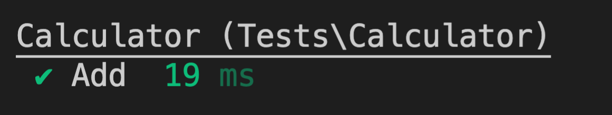

# PHPUnit 入門


<!--more-->

> [PHPUnit](https://phpunit.de/index.html) 是 PHP編程語言的單元測試框架。
>
> 本文從最簡單的範例，說明 PHPUnit 的使用方法


OS: macOS 10.15.7

php: 7.3.22

composer: 1.9.2


---
## 1. 建立測試專案

1. 建立專案資料夾並安裝最新版的 phpunit
    ```shell
    take php-tdd-demo
    composer require phpunit/phpunit
    ```

    這裡我們並不是全域安裝 phpunit，而是在這個專案下可以透過 `./vendor/bin/phpunit` 來執行 phpunit

    例如執行以下指令查看 phpunit 版本

    ```shell
    ./vendor/bin/phpunit --version
    ```

2. 建立 src, tests 資料夾
    ```shell
    mkdir src tests
    ```
    此時我們的資料夾結構就如下：
    - 📂 **src**
      - `我們的來源php程式碼(要被測試的程式)放在這裡`
    - 📂 **tests**
      - `測試程式將被放到這裡來`
    - 📂 **vendor**
    - composer.json
    - composer.lock

3. 在 composer.json 加上以下設定：

    ```shell
    "autoload": {
        "psr-4": {
            "Src\\": "src/"
        }
    },
    "autoload-dev": {
        "psr-4": {
            "Tests\\": "tests/"
        }
    }
    ```

---
## 2. 建立我的第一支測試程式

1. 在 `tests/` 資料夾新增一個檔案 `CalculatorTest.php`
    ```shell
    touch tests/CalculatorTest.php
    ```

    
所有可被執行的測試程式檔案必須取名為 `XxxTest.php` ！(以Test為結尾，大駝峰式命名)
    
1. 在 `tests/CalculatorTest.php` 寫入：
    ```php
    <?php

    use PHPUnit\Framework\TestCase;
    use Src\Calculator;

    class CalculatorTest extends TestCase
    {
        public function testAdd()
        {
            /** @Arange */
            $calculator = new Calculator();
            $expected = 2;

            /** @Act */
            $actual = $calculator->add(1, 1);

            /** @Assert */
            $this->assertEquals($expected, $actual);
        }
    }
    ```

    
1. 所有測試程式需要 `extends TestCase`
2. 測試函式名稱取為 `testXxxx` ！(以test為開頭，小駝峰式命名)
    

    在 testAdd 函式中，以3A原則撰寫測試：

   1. `Arange`：**準備好要被測試的資料** => $calculator 計算器物件、預期值 2
   2. `Act`：**調用受測物件的方法** => 計算器物件傳入兩個1，回傳相加的結果
   3. `Assert`：**驗證是否符合預期** => 驗證回傳之結果是否符合預期值 2

---
## 3. 執行測試

輸入以下指令會執行 `tests/` 資料夾底下符合測試命名規則的所有測試

```shell
./vendor/bin/phpunit tests
```

可以加入 `--testdox` 來顯示測試名稱、 `--colors` 使顯示的結果有顯色

```shell
./vendor/bin/phpunit tests --testdox --colors
```

結果：


紅燈！出現了 `Class 'Tests\Calculator' not found` 的錯誤，因為我們還沒開始寫 Calculator 物件

---
## 4. 開始實作 Calculator 與 add 方法

建立 `src/Calculator.php` 並寫入：

```php
<?php

namespace Src;

class Calculator
{
    public function add($a, $b)
    {
        return $a + $b;
    }
}
```

---
## 5. 再次執行測試程式

執行 `./vendor/bin/phpunit tests --testdox --colors`

結果：



綠燈！完成！

---
## 參考資料

- [TDD 範例三：用 PHPUnit 改寫範例二](https://ithelp.ithome.com.tw/articles/10218552)
- [PHPUnit 官方網站](https://phpunit.de/index.html)

程式碼： https://github.com/hdsbook/php-tdd-demo

